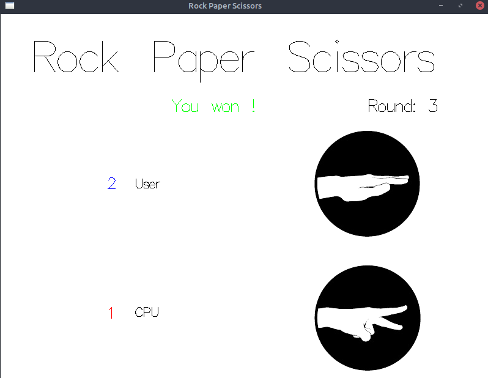

# rps
Rock paper scissors game written in Haskell with Gloss library.

## How to run
```
cabal v2-install
cabal v2-run
```

## Usage



**Events**
- ``r`` => Rock
- ``p`` => Paper
- ``s`` => Scissors 
